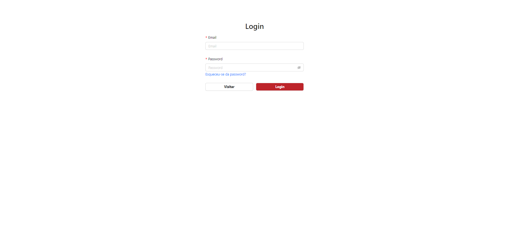
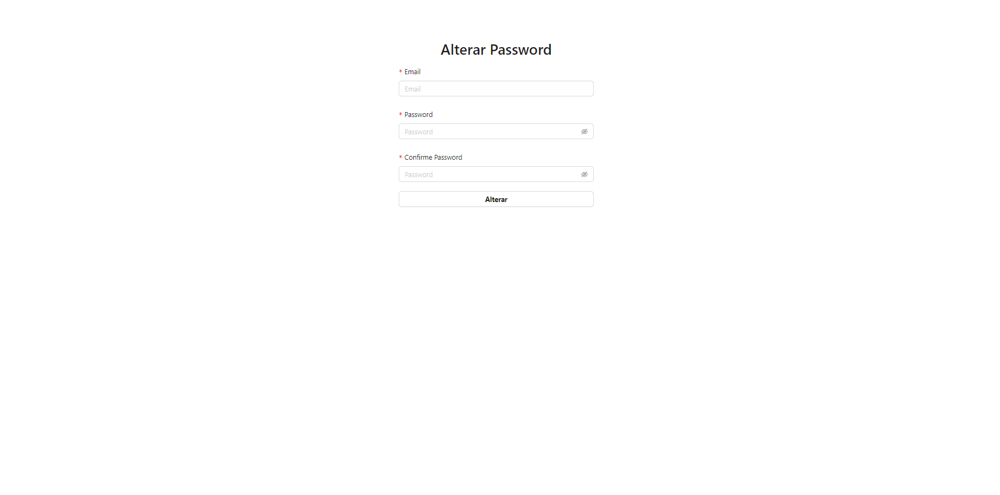
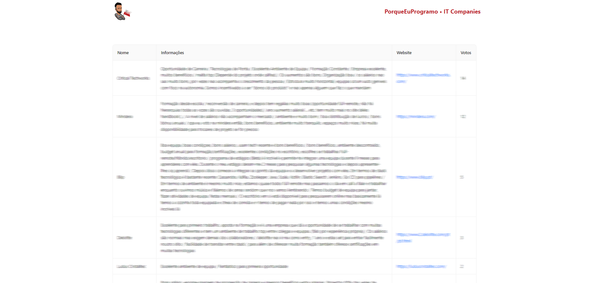
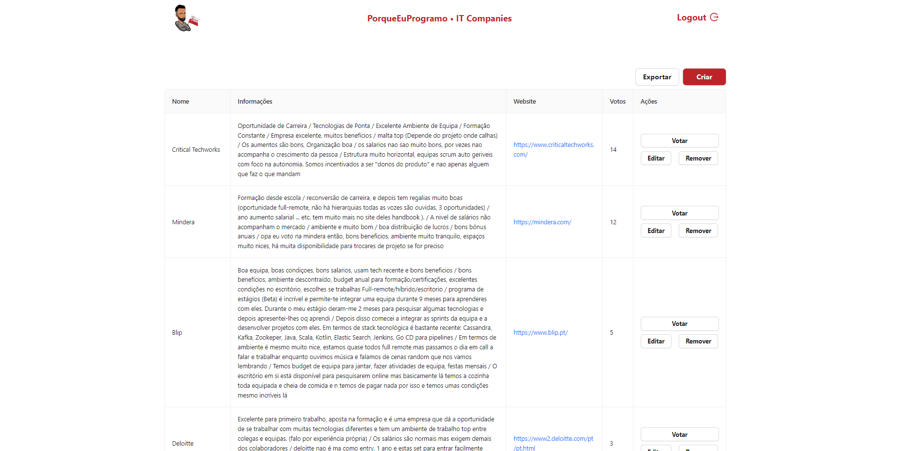
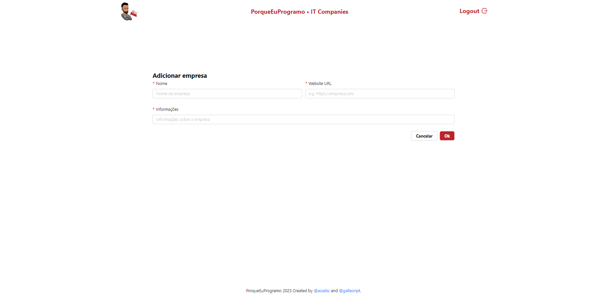
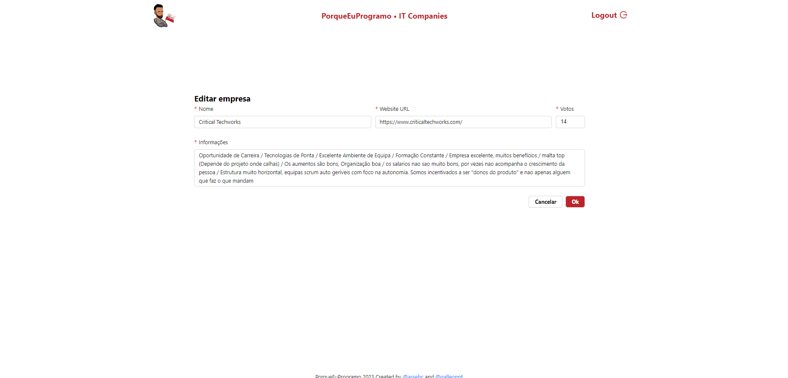

# pep-it-companies-app

A simple platform for @porqueeuprogramo to improve streams' dynamic!

This platform has a total of 6 pages with an intuitive design for a simple but effective use.

## Login and Forgot Password page

Composed by a simple `form` with just the required fields to `login` or `change passowrd` from an account.

 

## Companies List page

In the below images we can see the `main page` of the `platform` where it's distiguished by the `user` being `authenticated` or not. It's simply composed by a `table` who fills the requirements to identify and give informations about certain `company`.

 


## Create and Edit Form page

To `create` or `edit` the informations about certain `company` you will resort this pages.

 

<br>

# SETUP

# .env file

- Go to the `api` folder and rename the file `.env.example` to `.env`
- Fill all the variables with the correct data to your local project and run the api

# How to run the api

```sh
cd api

docker compose up -d # to start the dockers containers

npm install # install dependencies

npx prisma migration dev # migrations to db

npm run start # start the api
```


# How to run in localhost

```sh
cd frontend

npm install # install dependencies

npm run dev # start the frontend
```

# How to run in localhost

```sh
cd frontend

npm install # install dependencies

npm run dev # start the frontend
```

# How to make imports


- Open [postman](https://www.postman.com/) or [insomnia](https://insomnia.rest/)

- Do an `HTTP` request using `GET` method to `http://localhost:port/migrate`


# Requests collection

Inside the api folder is a file called `requests.json`. That file was exported from [insomnia](https://insomnia.rest/) and if you want to see the endpoints created I recommend you to install insomnia and import that file.
